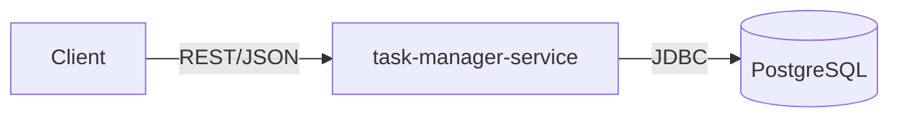

# Task Manager

Spring Boot REST service for managing tasks. API-contract-first via OpenAPI.

## Stack
- Java 25, Spring Boot 4.1.1
- Spring Web, Security, Data JPA
- PostgreSQL, Flyway
- MapStruct, Lombok

## API
API-first approach: [`api/openapi.yaml`](api/openapi.yaml) is the source of truth. Controller interfaces and DTO models are auto-generated at build time via `openapi-generator-maven-plugin` (packages `api` and `api.model`) — the controller implements the generated interface instead of hand-written contracts.

Swagger UI: http://localhost:8080/swagger

## Monitoring
Grafana-compatible metrics via Actuator/Prometheus:
- `/actuator/health`
- `/actuator/metrics`
- `/actuator/prometheus`

## Architecture


## Structure
```
api/                     OpenAPI specification
task-manager-service/    Spring Boot application
```

## Run
```bash
cd task-manager-service
./mvnw spring-boot:run
```

With Docker Compose:
```bash
cd task-manager-service
docker compose up
```

## Tests
```bash
cd task-manager-service
./mvnw test
```
