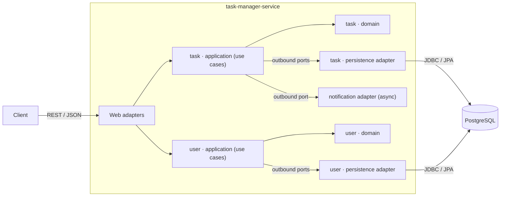
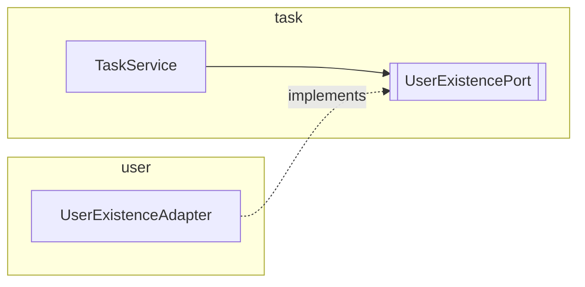

# Task Manager

A Spring Boot REST service for managing tasks, their watchers, and users. The project is
**API-contract-first** (OpenAPI) and built around a **feature-based hexagonal architecture**
(ports & adapters), with the architecture rules enforced automatically by ArchUnit tests.

---

## Table of Contents
- [What it does](#what-it-does)
- [Tech stack](#tech-stack)
- [Architecture](#architecture)
  - [Why hexagonal](#why-hexagonal)
  - [Feature slices and the task → user inversion](#feature-slices-and-the-task--user-inversion)
  - [Package structure](#package-structure)
  - [Enforced by ArchUnit](#enforced-by-archunit)
- [API](#api)
- [Data model](#data-model)
- [Getting started](#getting-started)
- [Configuration](#configuration)
- [Testing](#testing)
- [Monitoring](#monitoring)
- [Repository layout](#repository-layout)

---

## What it does

The service exposes a small task-management domain:

- **Tasks** — create tasks and list them (with their watchers). A task may optionally reference an
  owning user by id.
- **Task watchers** — register an email address to watch a given task. Creating a watcher validates
  that the task exists. A `TaskWatcher` is part of the `Task` aggregate (its lifecycle is bound to
  the task via `ON DELETE CASCADE`).
- **Users** — create, read, list, and soft-deactivate users (a user is never physically deleted;
  `active` is flipped to `false`).

When a task is created, a notification is dispatched **asynchronously** through an outbound
notification port (currently a stub email adapter).

---

## Tech stack

| Area            | Technology                                   |
|-----------------|----------------------------------------------|
| Language        | Java 25                                       |
| Framework       | Spring Boot 4.1.1 (Web MVC, Security, Data JPA, Actuator) |
| Database        | PostgreSQL + Flyway migrations               |
| Mapping         | MapStruct (entity ↔ API model)               |
| Boilerplate     | Lombok                                         |
| API contract    | OpenAPI 3.1 + `openapi-generator-maven-plugin` |
| Docs / UI       | springdoc Swagger UI                          |
| Metrics         | Micrometer + Prometheus registry             |
| Architecture tests | ArchUnit (JUnit 5)                        |
| Build           | Maven (wrapper included)                      |

---

## Architecture

The service follows a **hexagonal (ports & adapters)** architecture, organised
**by feature** rather than by technical layer.


```mermaid
flowchart LR
    Client -->|REST / JSON| Web[Web adapters]

    subgraph Service[task-manager-service]
        Web --> AppT["task · application (use cases)"]
        Web --> AppU["user · application (use cases)"]
        AppT --> DomT["task · domain"]
        AppU --> DomU["user · domain"]
        AppT -->|outbound ports| PersT["task · persistence adapter"]
        AppU -->|outbound ports| PersU["user · persistence adapter"]
        AppT -->|outbound port| Notify["notification adapter (async)"]
    end

    PersT -->|JDBC / JPA| DB[(PostgreSQL)]
    PersU -->|JDBC / JPA| DB
```

### Why hexagonal

The **application core** (domain + use cases) holds the business rules and depends only on
**ports** — plain Java interfaces it owns. Infrastructure (web, persistence, notification) lives in
**adapters** that depend on the core, never the other way around. All dependencies point **inward**,
which keeps the core framework-agnostic and makes cyclic dependencies structurally impossible.

- **Inbound ports** (`application.port.in`) — use cases the core offers (e.g. `TaskUseCase`).
  Implemented by services, called by web adapters.
- **Outbound ports** (`application.port.out`) — capabilities the core needs (e.g.
  `TaskRepositoryPort`, `TaskNotificationPort`). Implemented by adapters.

### Feature slices and the `task → user` inversion

There are two features, each a self-contained hexagon:

- **`task`** — owns both `Task` and `TaskWatcher` (one aggregate).
- **`user`** — owns `User`.

The `task` feature needs to check that a referenced user exists, which naively would mean
`task → user`. Instead the dependency is **inverted**: the `task` feature declares its own
`UserExistencePort`, and the `user` feature provides `UserExistenceAdapter` to implement it.


```mermaid
flowchart LR
    subgraph task
        TS[TaskService] --> UEP[[UserExistencePort]]
    end
    subgraph user
        UEA[UserExistenceAdapter] -.implements.-> UEP
    end
```

The result is a single, deliberate compile-time edge **`user → task`** — an acyclic graph. To keep
it that way at the persistence level too, `TaskEntity` references the user by **`UUID userId`**
(by id across the aggregate boundary), not by a JPA `@ManyToOne` association.

> **API note:** because tasks reference users by id, the task payload exposes `userId` only. To get
> the full user, call `GET /api/v1/users/{userId}`.

### Package structure

```
com.paxier.task_manager_service
├── api/..                       # GENERATED from OpenAPI (interfaces + models) — shared transport
├── task/                        # FEATURE: tasks + task watchers
│   ├── domain/                  # TaskDetails, TaskWatcherCommand
│   ├── application/
│   │   ├── port/in/             # TaskUseCase, TaskWatcherUseCase
│   │   ├── port/out/            # TaskRepositoryPort, TaskWatcherRepositoryPort,
│   │   │                        #   TaskNotificationPort, UserExistencePort
│   │   └── service/             # TaskService, TaskWatcherService
│   └── adapter/
│       ├── in/web/              # TaskRestController, TaskWatcherController
│       └── out/
│           ├── persistence/     # entities, JPA repositories, persistence adapters, mapper
│           └── notification/    # EmailNotificationAdapter (@Async)
├── user/                        # FEATURE: users
│   ├── application/             # UserUseCase, UserRepositoryPort, UserService
│   └── adapter/
│       ├── in/web/              # UserController
│       └── out/persistence/     # entity, repository, adapters (incl. UserExistenceAdapter), mapper
├── shared/web/                  # GlobalExceptionHandler (cross-cutting)
└── config/                      # SecurityConfig, AsyncConfig
```

### Enforced by ArchUnit

`HexagonalArchitectureTest` fails the build if the architecture is violated. It checks, among others:

- **No cyclic dependencies** between top-level slices.
- **Hexagon layering**: `adapter → application → domain` (never reversed).
- **Framework isolation**: the application core must not depend on `spring-web`, `spring-data`, or
  `jakarta.persistence`.
- **Feature boundaries**: `task` must not depend on `user`; `user` may reach `task` only through its
  published ports.

---

## API

Base path: `/api/v1`.

### OpenAPI vs. Swagger UI

These two are often confused, so to be precise:

- **OpenAPI** is the **specification format** — the file [`api/openapi.yaml`](api/openapi.yaml). It is
  the **single source of truth** for this project.
- **Swagger UI** is only a **viewer** that renders an OpenAPI spec as interactive docs. It does not
  define anything; it just displays the contract.

In other words, *API-first* here is driven by the OpenAPI spec and the code generator — **not** by
Swagger. Swagger UI is purely the presentation layer on top.

### API-first workflow

1. **Contract first:** you write/edit [`api/openapi.yaml`](api/openapi.yaml) — this is the contract.
2. **The build generates code:** the `openapi-generator-maven-plugin` (in `pom.xml`) produces from it
   - the **controller interfaces** (`TasksApi`, `UsersApi`, `TaskWatchersApi`) → package `api`
   - the **models** (`Task`, `User`, `TaskWatcher`, `TaskStatus`) → package `api.model`
   - configured with `interfaceOnly=true` (interfaces only, no ready-made controllers).
3. **You only implement:** your controllers (`implements TasksApi`) fill the generated interfaces
   with behaviour. If a controller deviates from the contract, **compilation fails** — the contract
   is binding.
4. **Swagger UI shows the contract:** `springdoc-openapi-starter-webmvc-ui` serves the UI at
   `/swagger`. It is deliberately configured (`springdoc.swagger-ui.url: /openapi.yaml`) to render the
   **hand-written spec**, not a view reverse-derived from the code — keeping the docs consistent with
   the actual contract.

### Endpoints

| Method | Path                      | Description                          |
|--------|---------------------------|--------------------------------------|
| GET    | `/api/v1/tasks`           | List all tasks (with watchers)       |
| POST   | `/api/v1/tasks`           | Create a task                        |
| POST   | `/api/v1/task-watcher`    | Add a watcher (email) to a task      |
| GET    | `/api/v1/users`           | List all users                       |
| POST   | `/api/v1/users`           | Create a user                        |
| GET    | `/api/v1/users/{userId}`  | Get a user by id                     |
| DELETE | `/api/v1/users/{userId}`  | Deactivate a user (soft delete)      |

Interactive docs (Swagger UI): <http://localhost:8080/swagger>

Example — create a task:

```bash
curl -X POST http://localhost:8080/api/v1/tasks \
  -H 'Content-Type: application/json' \
  -d '{"title": "Write docs", "status": "OPEN"}'
```

---

## Data model

Flyway migrations live in
[`task-manager-service/src/main/resources/db/migration`](task-manager-service/src/main/resources/db/migration)
and run on startup. All tables are in the `task` schema.

| Table              | Columns                                                      |
|--------------------|-------------------------------------------------------------|
| `task.task`        | `id`, `title`, `description`, `status`, `due_date`, `user_id` |
| `task.task_watcher`| `id`, `email`, `task_id` (FK → `task.task`, `ON DELETE CASCADE`) |
| `task.app_user`    | `id`, `first_name`, `last_name`, `email` (unique), `active` |

`status` is one of `OPEN`, `IN_PROGRESS`, `DONE`.

---

## Getting started

### Prerequisites
- JDK 25
- Docker (for PostgreSQL via Compose), or a local PostgreSQL instance

### 1. Start PostgreSQL

```bash
cd task-manager-service
docker compose up -d
```

This starts PostgreSQL on `localhost:5432` with database `task-manager-db`
(user `username` / password `password`).

### 2. Run the service

```bash
cd task-manager-service
./mvnw spring-boot:run
```

The app runs on <http://localhost:8080>, applies Flyway migrations, and serves Swagger UI at
`/swagger`.

> **Security:** for local development all endpoints are open (`permitAll`). Lock this down before
> any non-local deployment.

---

## Configuration

Defaults live in
[`application.yaml`](task-manager-service/src/main/resources/application.yaml). Key settings:

| Setting                       | Default                                           |
|-------------------------------|---------------------------------------------------|
| `spring.datasource.url`       | `jdbc:postgresql://localhost:5432/task-manager-db`|
| `spring.datasource.username`  | `username`                                         |
| `spring.datasource.password`  | `password`                                         |
| `spring.jpa.hibernate.ddl-auto` | `validate` (schema owned by Flyway)             |
| `springdoc.swagger-ui.path`   | `/swagger`                                         |

Override per environment with standard Spring mechanisms (env vars, `SPRING_*` properties, or a
profile-specific `application-<profile>.yaml`).

---

## Testing

```bash
cd task-manager-service
./mvnw test
```

The suite covers:
- **Unit tests** — use cases with mocked ports (e.g. `TaskServiceTest`).
- **Web slice tests** — controllers via `@WebMvcTest` with a mocked use-case port.
- **Persistence tests** — JPA repositories via `@DataJpaTest`.
- **Architecture tests** — `HexagonalArchitectureTest` (ArchUnit) guards the rules above.

---

## Monitoring

Actuator endpoints (Prometheus-compatible metrics):
- `/actuator/health`
- `/actuator/metrics`
- `/actuator/prometheus`

---

## Repository layout

```
api/                     OpenAPI specification (source of truth)
task-manager-service/    Spring Boot application
└── src/main/java/com/paxier/task_manager_service/
    ├── task/            Task + TaskWatcher feature (hexagon)
    ├── user/            User feature (hexagon)
    ├── shared/          Cross-cutting web concerns
    └── config/          Spring configuration
```
